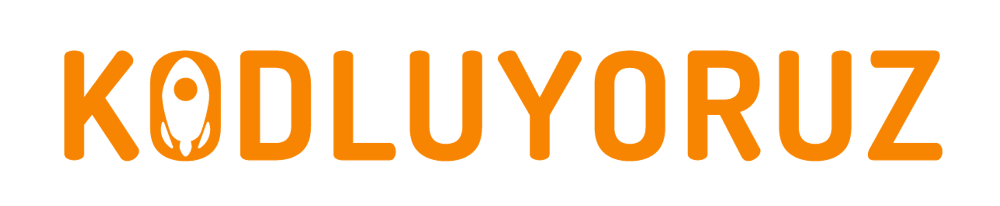

# Online Istanbul Applied Data Science 102 Bootcamp

* In the Kodluyoruz Online Istanbul Applied Data Science 102 Bootcamp event, which started on August 15th, the topics we cover, my homework and my repom where I shared my own projects.

* I will update this repo after finishing each lesson.

* Thank you Kodluyoruz for providing me with the opportunity to participate in this event.

* There are data sets we use, notebooks and assignments that we use in each lesson, and you can look at the lessons you want to learn or wonder about.

* The notebooks explained in the course belong to .

# Lessons

* Lesson1 : Decision trees
